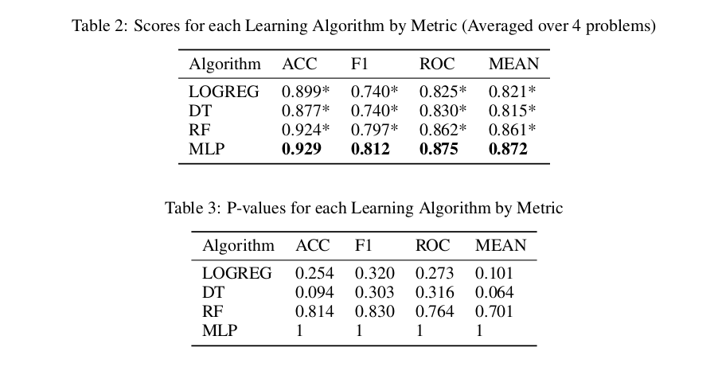
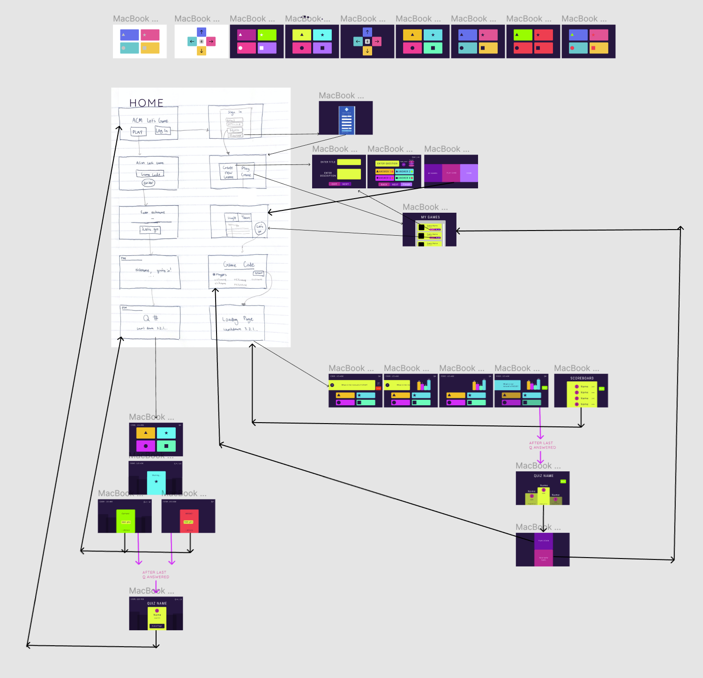
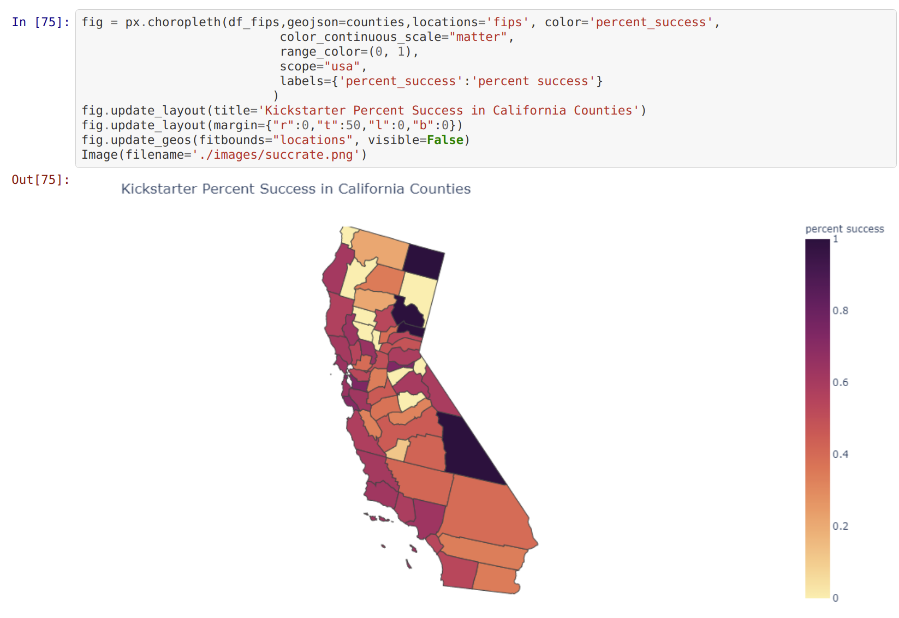
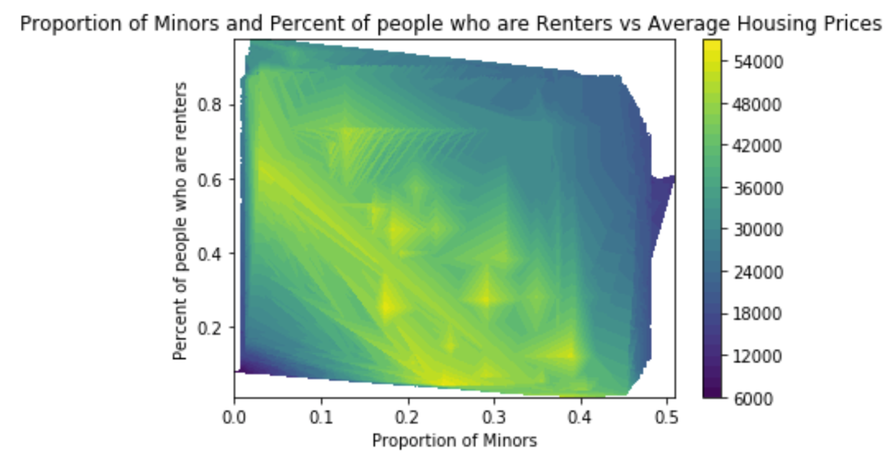
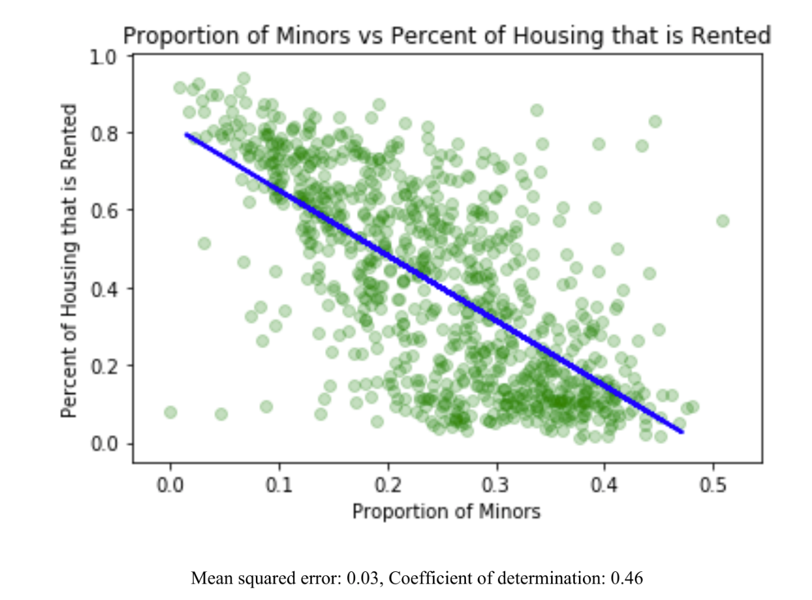

# Introduction

Hi! I'm Joshua, a 2nd year Cognitive Science major and Computer Science minor at the University of California, San Diego. I'm interested in research concerning computer vision, NLP, and aspects of cognition. 

# Projects

## [COGS 118 Classification Analysis](Final_paper.pdf)



For the final project of COGS 118A: Supervised Machine Learning Algorithms, I compared the performance of a variety of classification algorithms on a series of novel datasets. The purpose of this analysis is to verify the findings of past papers on general algorithm performance, which is generally achieved by my findings. 


## [ACM Quiz Time](https://github.com/acmucsd/acm-kahoot)



Paricipating in ACM Side Projects, I worked in a 6 person team to design and create a multiplayer quiz app that supports quiz creation and room hosting. Specificially, I used Node.js, Express, Socket.IO, and MongoDB to provide backend server functionality for the app. My group demoed the app to over 50 ACM members and successfully held a test quiz game with roughly **30** concurrent players. 

## Kickstarter Data Analysis



As a final project for COGS 108: Data Science in Practice, my group of 4 analyzed a dataset of kickstarter projects to explore spatial trends for project success. Using a variety of python libraries, we cleaned the required datasets, mapped geospatial information, and displayed the results of our analysis with visual representations. Additionally, we utilized classification algorithms to predict project success, achieving 80% accuracy with our best model. 

## [DataHacks](https://github.com/annieteaaa/DataHacks2020/blob/master/Dataset/Datahacks%202020%20Report.pdf)



At DataHacks 2020, a hackathon held by DS3 at UCSD, I worked in a team of 3 to analyze a given dataset on population data in San Diego. Using Pandas, Numpy and Motplotlib, we cleaned and analyzed high dimensional data to determine possible relationships between different variables. We presented our findings to a panel of judges along with a writeup on methods used and won the Beginner Track of the event. 



# Skills

- Languages: Python, Java, C, C++, Typescript, HTML/CSS, SQL, LaTeX, Matlab, ARM Assembly, Bash
- Technologies: Git, GDB, Valgrind, React, Node.js, Socket.IO, Pandas, Matplotlib, Keras, TensorFlow, Sklearn

# Goals for the Future

- [ ] Participate in an open source project
- [ ] Get GPU acceleration working so I can tinker with state of the art AI models
- [ ] Participate in an AI contest
- [ ] Think of and work on a passion project
- [ ] Make a reddit/discord bot
- [ ] Do more internships
- [ ] Contribute significantly to an academic paper
- [ ] Graduate?

# More about Me


In my free time, I enjoy reading books, ranging from high fantasy to nonfiction. Recently, I've been reading *Catch-22* as well as *Wheel of Time*. I also play a variety of video games, with some of my favorites being Celeste and Hollow Knight. Additionally, I'm a big fan of animated media, so I try to keep up to date on the latest Pixar movies and other shows. 

I'm also interested in humorous programming languages such as ArnoldC, depicted below:

```
IT'S SHOWTIME
TALK TO THE HAND "hello world"
YOU HAVE BEEN TERMINATED
```


As Victor Hugo said, 

> The future has several names. For the weak, it is impossible; for the fainthearted, it is unknown; but for the valiant, it is ideal.


The README for this repository can be found [HERE](README.md)